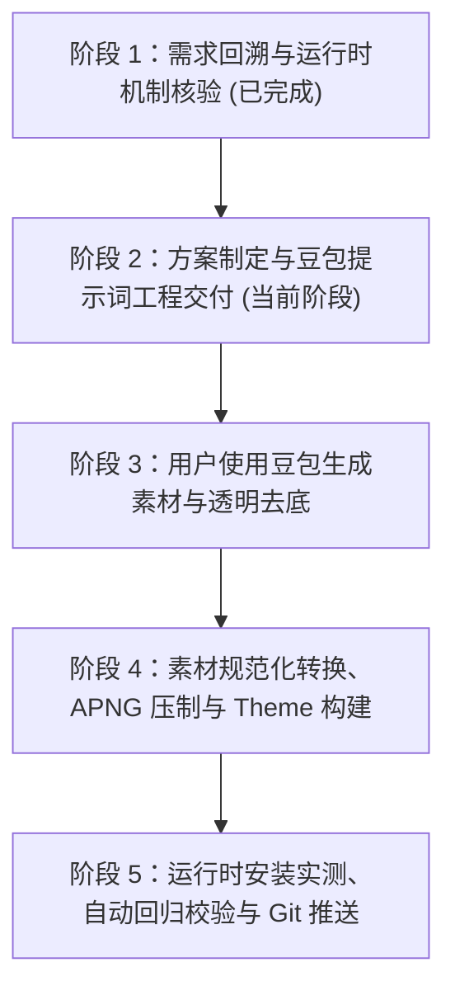

# 小兔子 R6.0 实施执行计划

> **原始需求与背景回溯**：
> - **提出时间**：2026-09-18
> - **业务背景**：`pet-forge` 为动画制作开源工坊，`clawd-on-desk`（`E:\Work2\AI_Work\tool\clawd-on-desk\clawd-on-desk\clawd-on-desk`）为桌面宠物运行时。用户需在 `work_space/R6_xiaotuzi/` 下，以参考图片（毛茸茸帅气武道小兔少年）为基准，采用 **APNG 路线** 制作高品质桌面宠物动画素材。
> - **用户原始诉求**：“项目下，我想按照APNG 路线方式，按照这张图片上的角色生成动画素材，在R6_xiaotuzi下，专门用于开源项目E:\Work2\AI_Work\tool\clawd-on-desk\clawd-on-desk\clawd-on-desk使用。你需要看下R1_doraemon，以及开源项目。然后告诉我步骤，并生成R6.0的方案和计划。你需要给我生成每个动画的提示词，我去用豆包生成适配后，提供给你。需要生动有趣”。
> - **已拍板技术决策**：
>   1. **采用 APNG 路线**：以带 Alpha 透明通道的 APNG 动画帧序列呈现 3D 毛发质感与细腻动作。
>   2. **Clawd 运行时适配**：关闭 SVG 挂点眼动（`eyeTracking.enabled: false`），利用 Clawd 原生 `` 通道与 `probeApngCycle` 探测循环。
>   3. **布局与尺寸控制**：`viewBox: {"x": 0, "y": 0, "width": 256, "height": 256}`，`visibleHeightRatio: 0.42`，`baselineBottomRatio: 0.05`。
>   4. **漫步朝向与循环闭环**：`roam.apng` 面朝右；循环状态（`idle`, `roam`, `working`, `thinking`, `sleeping`）首尾帧无缝闭环。
>   5. **交付范围**：6 个核心状态 APNG + `theme.json` + 打包与安装脚本。
> - **对接运行时**：Clawd-on-Desk (`theme.json` Schema v1)
> - **交付目标**：`work_space/R6_xiaotuzi/`

---

## 1. 里程碑阶段规划（Milestones & Phases）

---

## 2. 阶段详细任务分解

### 阶段 1：需求回溯与运行时机制核验（已完成）
- [x] **任务 1.1**：核查 `clawd-on-desk` 源码关于多媒体素材的处理逻辑（确认 `settings-i18n.js`、`theme-schema.js`、`animation-cycle.js` 原生支持 APNG/GIF/WebP）。
- [x] **任务 1.2**：核查 `R1_doraemon`、`cloudling` 的 `theme.json` 结构与尺寸契约，确认 APNG 模式下无需挂载 `#eyes-js`（需将 `eyeTracking.enabled` 设为 `false`）。
- [x] **任务 1.3**：创建 `work_space/R6_xiaotuzi/00_reference/` 目录，完整归档参考图 `rabbit_reference.jpg`。

### 阶段 2：方案制定与生动豆包提示词交付（当前阶段）
- [x] **任务 2.1**：编写 `work_space/docs/R6.0_小兔子_设计与技术方案.md`，明确 APNG 技术指标与视口规范。
- [x] **任务 2.2**：编写 `work_space/docs/R6.0_小兔子_实施执行计划.md`。
- [x] **任务 2.3**：编制 6 大核心状态（`idle`, `roam`, `working`, `thinking`, `sleeping`, `notification`）的高精准、生动有趣的豆包提示词（含垫图策略、动作时钟、镜头约束与循环闭环说明）。
- [ ] **任务 2.4**：向用户汇报实施步骤与提示词，等待用户在豆包完成生图/视频制作。

### 阶段 3：用户侧豆包素材生成与协同协作（用户执行中）
- [ ] **任务 3.1**：用户打开豆包 AI 视频/动画生图功能，上传 `rabbit_reference.jpg` 作为垫图。
- [ ] **任务 3.2**：按照提示词生成各状态的生动短视频/动图（纯白底或绿幕，固定机位，无镜头缩放）。
- [ ] **任务 3.3**：用户将生成的原始文件（MP4 或 GIF 或已去底透明 APNG）提供给 Agent，存放于 `work_space/R6_xiaotuzi/01_raw_doubao/`。

### 阶段 4：素材规范化转换、APNG 压制与 Theme 构建（Agent 执行）
- [ ] **任务 4.1**：编写 Python/Node 自动化脚本，对用户提供的视频/图片进行高精度抠图（去除白色/绿色背景，保留毛茸茸透明边缘与投影）。
- [ ] **任务 4.2**：对齐帧尺寸至统一居中视口（256×256），检测循环帧平滑度。
- [ ] **任务 4.3**：批量压制生成带透明通道的高品质 `.apng` 文件至 `work_space/R6_xiaotuzi/theme/assets/`。
- [ ] **任务 4.4**：生成标准 `work_space/R6_xiaotuzi/theme/theme.json`（无 BOM UTF-8）。
- [ ] **任务 4.5**：编写 `work_space/R6_xiaotuzi/install-to-clawd.ps1` 与 `package-theme.ps1`。

### 阶段 5：运行时安装实测、自动回归校验与 Git 推送（Agent 执行）
- [ ] **任务 5.1**：执行 `install-to-clawd.ps1`，将小兔子主题一键部署到 Clawd 本地用户主题目录。
- [ ] **任务 5.2**：通过 Clawd 的自动化测试与校验脚本验证 `theme.json` 与 APNG 循环周期。
- [ ] **任务 5.3**：执行 `git add .`、`git commit` 与 `git push origin main`，同步推送至 GitHub 仓库。

---

## 3. 质量门禁与成功判据

1. **APNG 视觉品质**：
   - 背景完全透明，无白边、杂边或绿幕反光溢出；
   - 待机、工作、思考、漫步与睡眠状态无缝平滑循环，无突兀跳帧。
2. **Clawd-on-desk 兼容性**：
   - `theme.json` 为无 BOM UTF-8，`JSON.parse` 无异常；
   - 桌面显示比例协调（`visibleHeightRatio: 0.42`），不遮挡主工作区；
   - 漫步巡逻方向正确（面朝右，向左走时系统自动水平翻转）；
   - 状态切换（打字、发呆、思考、睡眠）响应灵敏。
3. **版本库规范**：
   - 方案与计划完整归档于 `work_space/docs/`；
   - 远程仓库 `https://github.com/RyanChenJJH/pet-desk.git` 成功同步最新交付物。
