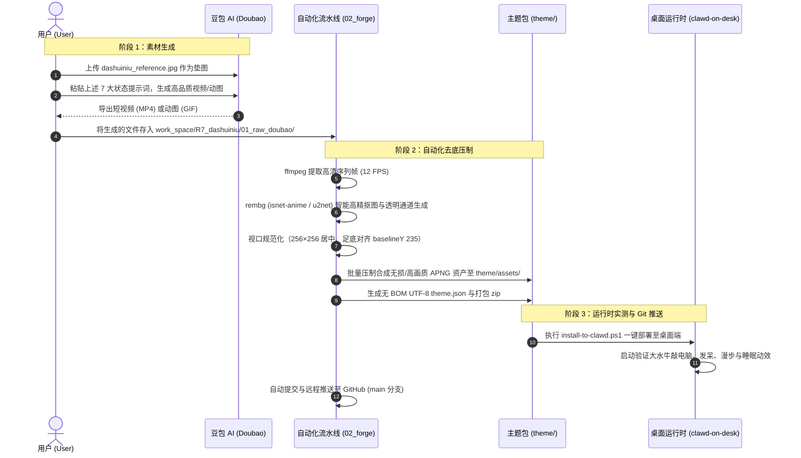

# 大水牛 R7.0 设计与技术方案

> **原始需求与背景回溯**：
> - **提出时间**：2026-09-19
> - **业务场景**：`pet-forge` 为动画制作开源工坊，`clawd-on-desk`（本地路径 `E:\Work2\AI_Work\tool\clawd-on-desk\clawd-on-desk\clawd-on-desk`）为桌面宠物运行时。项目下已有 `R1_doraemon`、`R2_clock`、`R3_dabaixiong`、`R4_GIRL`、`R5_labixiaoxin`、`R6_xiaotuzi`。当前需要在 `work_space/R7_dashuiniu/` 下，以用户提供的参考图片（拟人化 3D 欧美动画风猛男大水牛）为基准，采用 **APNG 路线** 制作生动有趣、反差萌十足的高品质桌面宠物动画素材。
> - **用户原始诉求**：“项目下，我想按照APNG 路线方式，按照R7_dashuiniu的图片上的角色生成动画素材，在R7_dashuiniu下，专门用于开源项目E:\Work2\AI_Work\tool\clawd-on-desk\clawd-on-desk\clawd-on-desk使用。你需要看下R1_doraemon，以及开源项目。然后告诉我步骤，并生成R7.0的方案和计划。你需要先给我生成每个动画的提示词，我去用豆包生成适配后，提供给你。需要生动有趣。比如大水牛坐在桌前敲电脑”。
> - **已拍板技术决策**：
>   1. **APNG 位图动图技术路线**：突破传统的纯 SVG 扁平矢量路线，采用高质量、高细节的 3D 毛发质感与 Alpha 透明通道 APNG（Animated PNG）动图格式，完美呈现大水牛壮硕肌肉、粗犷牛角质感、复古衬衫褶皱、反差萌敲电脑与丰富面部表情。
>   2. **运行时通道与循环探测**：对标 `calico` APNG 主题与 `clawd-on-desk` 源码，APNG 素材走客户端底层的原生 `` 标签硬件加速渲染通道；`animation-cycle.js` 内置 `probeApngCycle` 自动探测 APNG 帧持续时间与循环时长；在 `theme.json` 中配置 `eyeTracking.enabled: false`（位图无需 SVG DOM 挂点，眼神与面部动作直接由 AI 动画烘焙）。
>   3. **尺寸基线与桌面黄金视口**：采用标准规范画布尺寸（逻辑视口 `256×256`），严格遵守 `AGENTS.md` 固定尺寸基线（`visibleHeightRatio: 0.42`，`baselineBottomRatio: 0.05`），确保大水牛虽魁梧有力，但在桌面端维持最舒适协调的视觉比例，贴合底边，不遮挡主工作屏幕。
>   4. **漫步方向与循环闭环**：`roam.apng` 统一保持**面朝右侧 (Facing Right)**，Clawd-on-desk 向左漫步时会自动进行水平镜像翻转；循环状态动画（`idle`, `roam`, `working`, `thinking`, `sleeping`）必须做到首尾关键帧 100% 连贯，实现无缝平滑循环。
>   5. **核心状态矩阵交付**：重点覆盖 7 大核心状态（`idle`, `working`, `thinking`, `roam`, `sleeping`, `notification`, `error`），特别针对“坐在桌前敲电脑”设计专属反差萌动作。
> - **对接运行时**：Clawd-on-Desk (`theme.json` Schema v1)
> - **交付目标**：`work_space/R7_dashuiniu/`

---

## 1. 方案概述与角色设计哲学

参考图中角色呈现出鲜明的顶级 3D 动画电影质感（类似迪士尼《疯狂动物城》中的博戈局长风格，但更具亲和力、憨厚而充满力量感）。

### 1.1 核心特征提炼与锚定
1. **头部与面部**：
   - **雄浑大牛角**：横贯头顶的苍劲厚重水牛弯角，外展弧度饱满，带有真实的骨质环纹与微磨损细节，气势十足。
   - **粗犷面容与胡茬**：宽阔厚重的黑灰色牛吻与大鼻孔（敲电脑或喘气时可喷出两股白气），下巴上挂着质感浓密的花白短络腮胡。
   - **沉稳眼神与灵动小耳**：深褐色/琥珀色坚毅眼神，浓密眉骨，牛角下方藏着两只毛茸茸的小牛耳，能配合情绪机灵摆动。
2. **体魄与服饰**：
   - **肌肉猛男体魄**：倒三角魁梧身材，胸肌厚实，手臂粗壮如树干，覆盖短密深灰绒毛。
   - **复古开领短袖衬衫**：墨绿/海青色复古立领短袖 Polo 衫，短袖卷起包住二头肌，带有真实细腻的棉麻布料褶皱与排扣。
   - **宽松卡其休闲裤与牛蹄**：浅卡其灰直筒长裤（带腰带环与裤袋），裤脚下露出覆毛脚踝与厚重深色的水牛分瓣蹄脚。
   - **反差萌大手爪**：粗壮有力的大手（四指带角质指甲），在敲击微型键盘或拿着小咖啡杯时具有极佳的幽默反差萌。
3. **动作性格特征**：
   - **反差萌、沉稳、靠谱、专注**：外表凶猛高大的大牛牛，其实是个认真敬业的“牛马”程序员大叔。面对工作时无比专注，休息时憨厚可爱，喜怒哀乐生动有趣。

---

## 2. APNG 路线与 SVG 路线的架构对比

| 维度 | R1_doraemon (纯 SVG 路线) | R7_dashuiniu (APNG 路线) |
|---|---|---|
| **资产载体** | 矢量 XML 代码 (`.svg`) | 透明带 Alpha 通道动态位图序列 (`.apng`) |
| **视觉呈现** | 扁平几何色块、线性渐变、描边骨骼 | 超写实 3D 毛发质感、真实布料褶皱、立体光影与粒子特效 |
| **Clawd 渲染通道** | `<object>` 容器，实时操纵 SVG DOM | `` 硬件加速纯净位图渲染通道 |
| **眼球光标跟随** | 依赖 `#eyes-js` 挂点计算实时鼠标偏转 | 禁用 `eyeTracking.enabled: false`（眼神微动直接由 AI 动画烘焙） |
| **循环周期检测** | 解析 SVG 内联 CSS/SMIL 动画时长 | `animation-cycle.js` 的 `probeApngCycle` 自动探测帧时钟 |
| **制作生产方式** | 手工分层矢量描摹 + CSS 关键帧绑定 | 豆包 AI 生成生动短视频 -> rembg 高精度抠图 -> APNG 帧压制合成 |

---

## 3. 运行环境与 Theme 配置规范 (`theme.json`)

`work_space/R7_dashuiniu/theme/theme.json` 严格遵守 Clawd Schema v1，保存为 **无 BOM 的纯 UTF-8 编码**：

```json
{
  "schemaVersion": 1,
  "name": "Dashuiniu",
  "author": "Antigravity & User",
  "version": "1.0.0",
  "description": "Muscular anthropomorphic water buffalo desktop pet with animated APNG assets.",
  "viewBox": {
    "x": 0,
    "y": 0,
    "width": 256,
    "height": 256
  },
  "layout": {
    "contentBox": {
      "x": 32,
      "y": 20,
      "width": 192,
      "height": 215
    },
    "centerX": 128,
    "baselineY": 235,
    "visibleHeightRatio": 0.42,
    "baselineBottomRatio": 0.05
  },
  "eyeTracking": {
    "enabled": false
  },
  "states": {
    "idle": [
      "idle.apng"
    ],
    "roam": [
      "roam.apng"
    ],
    "working": [
      "working.apng"
    ],
    "thinking": [
      "thinking.apng"
    ],
    "sleeping": [
      "sleeping.apng"
    ],
    "notification": [
      "notification.apng"
    ],
    "attention": [
      "notification.apng"
    ],
    "error": [
      "error.apng"
    ]
  },
  "sleepSequence": {
    "mode": "direct"
  },
  "hitBoxes": {
    "default": {
      "x": 32,
      "y": 20,
      "w": 192,
      "h": 215
    },
    "sleeping": {
      "x": 30,
      "y": 80,
      "w": 196,
      "h": 155
    }
  },
  "sleepingHitboxFiles": [
    "sleeping.apng"
  ]
}
```

---

## 4. 状态动画矩阵与视觉语义设计

| 状态名 | 资产文件名 | 动作视觉语义与生动细节 | 循环与方向要求 |
|---|---|---|---|
| **`working`** | `working.apng` | **反差萌疯狂敲电脑**：大水牛坐在办公椅上，身前是一张稍微偏紧凑的写字台。粗壮有力的大手掌以不可思议的敏捷在微型发光键盘上飞速敲击（化作残影）；鼻梁上架着副可怜的小圆框眼镜，神情极度严肃凝神注视笔记本屏幕；牛角随节奏微晃，鼻孔偶尔喷出两道得意的白色蒸汽；桌上立着写着“BIG BOSS”的咖啡杯。 | 首尾无缝平滑循环 |
| **`idle`** | `idle.apng` | **沉稳待机观察**：大水牛挺拔站立，双手叉腰或单手插在卡其裤袋里；宽阔厚实的胸膛随着呼吸缓缓起伏；粗犷威武的大牛角泛着自然光泽，小牛耳偶尔轻巧地一抖；眼神沉稳自信地平视前方并自然眨眼；身后结实的牛尾巴悠闲自得地左右轻轻摇晃。 | 首尾完全闭环循环 |
| **`roam`** | `roam.apng` | **大佬巡场漫步**：**角色统一面朝右侧（90度侧视或侧前视）**！大水牛迈着沉稳踏实、霸气外露的脚步向前漫步（原地 Walk cycle）。每一步都稳健有力，双臂随着步伐自然豪迈甩动，胸膛微挺，牛尾随着步伐节奏晃动，嘴角泛着自信坦然的微笑。 | 统一面朝右，无缝循环 |
| **`thinking`** | `thinking.apng` | **摸角沉思/琢磨代码**：大水牛一只手臂横抱在胸前，另一只毛茸粗手托着下巴，粗硬的络腮胡被揉动；脑袋微微一歪，大眼睛滴溜溜往右上角瞟；粗壮的食指有节奏地轻敲自己的弯牛角；头顶缓缓浮现旋转的卡通发光齿轮或小问号泡泡。 | 首尾平滑循环 |
| **`sleeping`** | `sleeping.apng` | **趴桌大睡/呼噜震天**：大水牛像一座稳重的小山丘般趴在桌上（或侧卧抱臂睡在地板上），双臂环抱垫在下巴下，两只巨大的牛角自然搭向两旁；胸背随着深沉的呼吸均匀起伏；粗大的牛鼻孔有规律地呼出半透明的粉蓝色“Zzz”睡眠泡泡（慢慢变大后噗地破裂），画面极其温馨治愈。 | 首尾完全闭环循环 |
| **`notification`** | `notification.apng` | **牛气冲天/兴奋比赞**：大水牛突然神气活现地站直，单手叉腰，另一只大手在胸前竖起粗壮的大拇指（比出大大的赞）；露出整齐结白的大板牙开怀大笑；双眼变成发光的星星，头顶炸开金色胜利礼花与闪烁的感叹号，充满正能量！ | 可短循环或单次播放 |
| **`error`** | `error.apng` | **代码崩溃/抱头抓狂**：面对屏幕或错误提示，大水牛目瞪口呆，双眼变成圈圈眼（蚊香眼）；两只大手崩溃地抱住自己的大牛角连连摇晃；鼻孔气得喷出浓浓的白色蒸汽，头顶悬浮着一朵落雷的小乌云，满脸写着“BUG怎么又来了”的反差喜感。 | 首尾闭环循环 |

---

## 5. 豆包 AI (Doubao) 生成提示词工程库

为了保证在豆包 AI 中生成的角色具有**100% 外貌一致性**、**动作生动自然**以及**后续 APNG 自动去底抠图的超高精度**，必须严格遵循以下生成规范：
1. **必须使用垫图 (Image-to-Video / 参考图一致性)**：将本工程提供的 `work_space/R7_dashuiniu/00_reference/dashuiniu_reference.jpg` 上传作为形象基准图，设定高角色还原度。
2. **纯白纯净背景红线**：所有提示词结尾必须强化“纯白色无阴影背景（Pure white background, no floor shadows）”，绝对避免复杂的写实室内环境（除工作状态的微型桌面外），方便工具链实现一键透明通道提取。
3. **固定机位与无镜头运动**：必须强调“固定摄像机镜头（Static camera），无变焦、无推拉、无运镜平移，全身完整显示在画面中央”，确保桌宠在窗口内平稳站立不位移。
4. **循环闭环意识**：提示词中明确说明“动作首尾帧完全一致平滑循环（Seamless loop）”。

---

### 5.1 通用角色形象锚定词（每条 Prompt 前置必带）
> **角色基础锚定描述**：
> “根据参考图的角色外观：一个强壮威猛又带有反差萌的拟人化 3D 水牛硬汉（类似疯狂动物城动画电影风格）。头顶有一对巨大而苍劲横展的弯曲深色水牛角，面孔宽阔，大鼻孔，结实的下巴上有一撮浓密的花白短络腮胡，深褐色坚毅而自信的眼睛。身材极其健硕宽阔，覆盖深灰色毛发。身穿一件复古墨绿色短袖开领 Polo 衬衫（短袖卷起露出粗壮手臂），下身穿一条宽松的浅卡其色休闲工装长裤，脚穿深色水牛分瓣蹄。3D 动画电影质感，逼真毛发与布料细节，纯白色纯净无阴影背景，固定机位，全身完整显示，无镜头晃动。”

---

### 5.2 各状态详细提示词 (Prompt Matrix)

#### 1. `working` (专注敲电脑 - 核心反差萌)
- **中文提示词**：
  > [前置角色基础锚定描述]。
  > **动作描述**：专注工作与高速打字循环动画。魁梧壮硕的大水牛正坐在一张稍微紧凑的小办公桌前，鼻梁上滑稽地架着一副小巧的复古圆框眼镜。他巨大的毛茸双掌在微型发光键盘上化为残影高速敲击打字，神情极其认真严肃地凝视着前方的笔记本电脑屏幕，两只大牛角随着打字节奏微颤，粗大的牛鼻孔随着节奏得意地喷出两缕细细的白色蒸汽。桌角放着一个印着白色大字的超大咖啡杯。整体动感极强，充满幽默反差萌，动作首尾帧无缝闭环循环。纯白色背景，固定机位，全身与桌面完整居中展示。
- **英文参考 (辅助输入)**：
  > 3D animation of the muscular anthropomorphic water buffalo sitting at an office desk typing frantically on a small glowing keyboard. His giant furry hands move at lightning speed with cartoon blur. He wears comical tiny round glasses on his broad snout, staring intensely at the laptop screen. Gentle white steam puffs from his nostrils rhythmically. Big coffee mug on desk. Humorous contrast, intense focus. Seamless looping animation. Pure white background, no floor shadows, static camera, full body and desk centered.

#### 2. `idle` (沉稳待机/呼吸观察)
- **中文提示词**：
  > [前置角色基础锚定描述]。
  > **动作描述**：待机呼吸与微动循环动画。大水牛霸气而沉稳地站在原地，单手插在卡其裤兜里，另一手自然下垂。雄伟的胸膛随着深沉均匀的呼吸缓缓起伏。头顶苍劲的大弯角质感厚重，耳根下的两只小牛耳偶尔机警地轻轻颤动一下。深褐色的眼睛平静自信地平视前方，每隔 2 到 3 秒自然舒缓地眨一下眼。身后的牛尾巴悠闲地微微摆动，偶尔抬起大手摸摸自己结实的胡茬，神态从容自如。首尾关键帧完全一致无缝循环。纯白色背景，无地面杂色，固定镜头，全身完整居中。
- **英文参考 (辅助输入)**：
  > 3D animation of the anthropomorphic water buffalo standing in idle pose. Breathing loop, massive muscular chest rising and falling rhythmically. One hand in pocket. His giant sweeping horns catch subtle light, and his cute small ears twitch softly. Warm brown eyes blink naturally every few seconds. Fluffy buffalo tail sways gently. Calm, confident and friendly expression. Perfect seamless loop. Pure white background, static camera, full body centered.

#### 3. `roam` (巡逻漫步 - 面朝右侧)
- **中文提示词**：
  > [前置角色基础锚定描述]。
  > **动作描述**：巡逻漫步循环动画。**角色整体必须完全面朝右侧（90度侧视或侧前侧）**。大水牛迈着沉稳踏实、霸气巡场的步伐大步向前行走（原地踏步走 Walk cycle in place）。步伐孔武有力，双臂随着步伐自然有力地前后摆动，胸膛挺拔，大牛角随着走动微仰，身后的尾巴随着步伐节奏欢快摇晃，脸上带着成竹在胸的淡定微笑。动作首尾帧平滑衔接无缝循环。纯白色背景，固定摄像机，角色居中，全身完整展示。
- **英文参考 (辅助输入)**：
  > 3D animation of the muscular water buffalo walk cycle, **strictly facing to the right**. Walking in place with heavy, confident, majestic strides like a boss patrolling. Arms swinging rhythmically, broad chest held high, horns held proud. Tail swaying with the steps. Confident and calm stride. Seamless walk cycle loop. Pure white background, static camera, centered full body.

#### 4. `thinking` (摸角沉思/琢磨代码)
- **中文提示词**：
  > [前置角色基础锚定描述]。
  > **动作描述**：深度思考循环动画。大水牛一只结实粗壮的手臂横抱在胸前，另一只大手托着腮帮子，粗硬的短胡茬被手掌揉动。脑袋微微歪向一侧，眼神往右上角滴溜溜打转做思考状。粗大的食指有节奏地轻轻叩击着自己的大弯角尖端，小牛耳一耸一耸。头顶空气中缓缓浮现一个半透明发光的微型卡通齿轮或小问号泡泡，随后他眼神一亮露出领悟的微笑。动作首尾平滑衔接无缝循环。纯白色背景，固定机位，全身展示。
- **英文参考 (辅助输入)**：
  > 3D animation of the water buffalo deep in thought. One arm crossed over chest, other hand scratching his stubbled chin quizzically. Head tilted slightly, eyes darting upward as he ponders. His index finger gently taps the tip of his sweeping buffalo horn. A small glowing cartoon gear bubbles above his head. Subtle thoughtful smirk. Seamless loop. Pure white background, static camera, full body.

#### 5. `sleeping` (趴桌大睡/呼噜震天)
- **中文提示词**：
  > [前置角色基础锚定描述]。
  > **动作描述**：香甜深度睡眠循环动画。大水牛像一座安稳的小山丘般趴在桌面上（或舒适侧卧在地毯上），两只粗壮的手臂叠在一起枕在下巴下，两只巨大的弯曲牛角自然向两侧舒展。双眼香甜闭合，厚实的后背随着深长的呼吸缓慢起伏。宽阔的牛鼻孔有规律地呼出一个半透明粉蓝色的卡通“Zzz”睡眠泡泡，泡泡随着呼吸缓缓胀大随后噗地破裂消散，偶有小小的耳尖抖动，画面温馨安详又可爱。首尾关键帧一致无缝循环。纯白色背景，固定镜头，全身展示。
- **英文参考 (辅助输入)**：
  > 3D animation of the giant water buffalo sleeping soundly, resting his head on his crossed arms like a peaceful mountain. Giant horns resting gently. Peaceful closed eyes, slow deep breathing with back and shoulders rising and falling. A soft translucent 'Zzz' cartoon bubble grows from his wide nostril and gently pops. Incredibly cozy, adorable big-guy sleep loop. Seamless loop. Pure white background, static camera, full body.

#### 6. `notification` / `attention` (牛气冲天/兴奋比赞)
- **中文提示词**：
  > [前置角色基础锚定描述]。
  > **动作描述**：庆祝胜利与热情比赞动画。大水牛精神振奋地站直，单手叉腰，另一只粗壮的毛茸大手向前竖起大大的拇指（点赞手势），露出两排整齐洁白的大板牙灿烂大笑，双眼里闪烁着金色的亮星闪光。头顶炸开几颗金色的胜利小礼花特效，头上的牛角仿佛闪耀着金色光晕，充满力量感与鼓舞人心的正能量。短动作首尾平滑衔接循环。纯白色背景，固定镜头，全身完整展示。
- **英文参考 (辅助输入)**：
  > 3D animation of the water buffalo celebrating enthusiastically. He stands tall, one hand on hip, giving an enthusiastic big thumbs-up with his giant furry hand. Big toothy confident grin with golden star sparkles in his eyes. Tiny golden confetti sparks burst cheerfully over his head. High energy, wholesome encouraging boss energy. Seamless loop. Pure white background, static camera, full body.

#### 7. `error` (代码崩溃/抱头抓狂)
- **中文提示词**：
  > [前置角色基础锚定描述]。
  > **动作描述**：崩溃抓狂与滑稽沮丧循环动画。大水牛看着面前的 Bug 提示，两只眼睛瞬间变成了转圈圈的蚊香眼，张大嘴巴露出难以置信的绝望表情。他用两只粗壮的大手紧紧抱住自己的大弯角左右抓狂摇晃，粗大的牛鼻孔气呼呼地喷出一股股浓密的白色蒸汽，头顶悬浮着一团滑稽的黑色下雨乌云，全身微微发抖，充满反差喜剧效果。首尾动作平滑无缝循环。纯白色背景，固定镜头，全身展示。
- **英文参考 (辅助输入)**：
  > 3D animation of the water buffalo reacting comically to an error. Spiral dizzy eyes, open mouth in dramatic disbelief. He clutches his giant horns with both hands, shaking his head in comical distress. Puffs of dramatic white steam blow from his wide nostrils. A tiny cartoon dark thundercloud hovers above his head with harmless mini rain. Funny exaggerated panic. Seamless loop. Pure white background, static camera, full body.

---

### 5.3 扩展进阶与互动彩蛋提示词库 (Interactive & Variety Pack)

#### 8. `react-drag` (被鼠标悬空抓起/拎住四肢挣扎 - 极度反差萌 ⭐)
- **中文提示词**：
  > [前置角色基础锚定描述]。
  > **动作描述**：被悬空拎起挣扎循环动画。威猛魁梧的大水牛仿佛被一只无形的大手捏住后颈皮提溜在半空中悬空！两只粗壮的手臂在空中慌乱地胡乱扑腾划动，两条穿着卡其裤的大粗腿在半空中滑稽地交替蹬腿扑腾。大牛角微微下垂，两只牛眼瞪得圆滚滚，嘴巴委屈地撅起，满脸写着“快放老牛下来”的震惊与无助。悬空挣扎动作首尾平滑无缝循环。纯白色背景，固定机位，角色居中全身展示。
- **英文参考 (辅助输入)**：
  > 3D animation of the massive muscular water buffalo being comically lifted into the air by an invisible hand. Flailing his giant arms in the air, legs pedaling frantically in comical distress. His big brown eyes wide with utter shock and mild embarrassment, mouth agape. Utterly hilarious contrast of a giant beast dangling helpless. Seamless flailing loop. Pure white background, static camera, centered full body.

#### 9. `react-poke` / `clickLeft` (被鼠标戳击/拍击胸肌大笑)
- **中文提示词**：
  > [前置角色基础锚定描述]。
  > **动作描述**：被戳击反应与展示硬汉体魄。大水牛胸口仿佛被轻轻戳了一下，身体微微后撤半步，随即豪迈大笑起来。他霸气地挺起宽阔结实的胸膛，抬起两只粗壮的毛茸大手“咚咚”用力拍击自己的坚实胸肌，犹如擂鼓般结实沉稳。随后他双手叉腰，扬起粗犷雄伟的大牛角，咧开大嘴露出灿烂自信的笑容，仿佛在说“老牛身板硬朗得很！”。动作自然平滑循环。纯白色背景，固定镜头，全身展示。
- **英文参考 (辅助输入)**：
  > 3D animation of the water buffalo reacting to a poke. He flinches back slightly, then chuckles heartily and puffs out his chest proudly. He enthusiastically thumps his massive muscular chest twice with his giant furry fists like a friendly gorilla/iron man, nodding confidently with a wide friendly grin. Strong, reliable, full of vigor. Seamless loop. Pure white background, static camera, full body.

#### 10. `react-double` / `double` (双击互动/超酷墨镜手枪手势)
- **中文提示词**：
  > [前置角色基础锚定描述]。
  > **动作描述**：帅气耍帅与手枪手势动画。大水牛从墨绿衬衫兜里掏出一副复古黑色酷炫墨镜单手戴在鼻梁上，另一手霸气地单指推了一下镜框，神态酷拽自信。接着双手在腰间帅气比出“手枪”手势朝前方连点两下，左眼微微挑眉，嘴角泛起坏坏的帅气微笑，头顶闪过一道帅气的金色高光星芒。首尾平滑衔接循环。纯白色背景，固定镜头，全身展示。
- **英文参考 (辅助输入)**：
  > 3D animation of the cool water buffalo putting on retro dark sunglasses. He pushes the sunglasses up with a suave finger tap, smiling with charming swagger. He points finger guns forward with both giant hands, winking with confident coolness. A tiny cartoon star glints off his sunglasses. Effortlessly cool boss vibe. Seamless loop. Pure white background, static camera, full body.

#### 11. `idle-coffee` (悠闲品尝大号马克杯热咖啡)
- **中文提示词**：
  > [前置角色基础锚定描述]。
  > **动作描述**：品尝咖啡与治愈享受循环动画。大水牛两只巨大的毛茸大手极其温柔地捧着一个印着“BUFFALO”的特大号陶瓷马克杯。他小心翼翼地把杯子凑到宽大的牛鼻前，嘟起嘴唇轻轻吹拂冒起的袅袅白气。随后眯起眼睛满足地小抿了一口热咖啡，长长呼出一口安逸的白气，脸上露出极其治愈、幸福而放松的微笑，牛耳舒畅地轻轻颤动。动作首尾平滑无缝循环。纯白色背景，固定机位，全身完整展示。
- **英文参考 (辅助输入)**：
  > 3D animation of the gentle giant water buffalo holding a large ceramic coffee mug with both hands. He carefully blows on the rising steam with pouted lips, then takes a tiny delicate sip. His eyes close in pure bliss, sighing out a cozy puff of steam with a peaceful, happy smile. Super wholesome, cozy and comforting loop. Pure white background, static camera, full body.

#### 12. `idle-workout` (背地里偷偷秀肌肉)
- **中文提示词**：
  > [前置角色基础锚定描述]。
  > **动作描述**：秘密炫耀肌肉循环动画。大水牛警惕地左右扭头观察四周确认没人看，随后嘴角一歪，得意地在原地摆出经典健美先生的“前双肱二头肌展示”姿势！粗壮如树干的手臂隆起硕大坚硬的二头肌，胸肌微微跳动，粗犷的牛角高昂。展示 2 秒后，他心满意足地收回姿势，轻咳一声，抬手若无其事地正了正墨绿衬衫领口，假装严肃。首尾动作无缝循环。纯白色背景，固定镜头，全身展示。
- **英文参考 (辅助输入)**：
  > 3D animation of the water buffalo glancing left and right suspiciously to check if anyone is looking, then cheekily flexing his massive bicep muscles like a bodybuilder. His shirt sleeves strain against his muscular arms, grinning with secret pride. He then quickly relaxes, clears his throat, and straightens his shirt collar trying to look innocent. Funny, cute vanity. Seamless loop. Pure white background, static camera, full body.

#### 13. `welding` / `building` (硬核电焊修Bug - 火花四溅)
- **中文提示词**：
  > [前置角色基础锚定描述]。
  > **动作描述**：硬核维修与电焊工作循环动画。大水牛脸上戴着一副带有暗色镜片的重型工业电焊护目面罩。他半蹲在地上，一手拿着金属防护板，另一手持高科技焊枪，专注地对一块悬浮的发光机械电路零件进行电焊。蓝白色的绚丽火花噼里啪啦飞溅四射。焊完后，他潇洒地用大手将电焊面罩向上翻起推到额头上，吹了吹焊枪口的青烟，露出自信满意的笑容。动作首尾连贯循环。纯白色背景，固定机位，全身展示。
- **英文参考 (辅助输入)**：
  > 3D animation of the water buffalo wearing a flipped-down industrial welding mask, holding a futuristic welding torch and welding glowing cybernetic circuitry. Bright cartoon sparks crackle and burst blue and gold. He flips up his welding mask to his forehead, blows a puff of smoke from the torch tip, grinning with accomplishment. Badass tech mechanic energy. Seamless loop. Pure white background, static camera, full body.

#### 14. `sweeping` (清理内存垃圾/奋斗扫地牛牛)
- **中文提示词**：
  > [前置角色基础锚定描述]。
  > **动作描述**：扫除垃圾与代码清理循环动画。大水牛额头上扎着一条写着红色汉字“必胜”的白色奋斗头巾。他认认真真弯着魁梧的腰，手里拿着一把小扫帚和一个小撮箕，一丝不苟地在地面上扫着掉落的发光字母代码碎片和杂物，把它们归拢扫进撮箕里。擦了擦额头汗水，干劲十足。动作首尾无缝平滑循环。纯白色背景，固定镜头，全身展示。
- **英文参考 (辅助输入)**：
  > 3D animation of the water buffalo wearing a white motivational headband tied around his forehead. He bends his bulky frame diligently, holding a mini broom and dustpan, sweeping glowing digital code snippets off the floor. Wipes sweat from his brow, determined and hardworking. Wholesome cleaning / garbage collection animation. Seamless loop. Pure white background, static camera, full body.

#### 15. `carrying` (扛服务器机箱负重前行)
- **中文提示词**：
  > [前置角色基础锚定描述]。
  > **动作描述**：搬运重物负重前行循环动画。**角色面朝右侧**。大水牛宽阔厚实的右肩上稳稳扛着一台体积庞大、带有闪烁蓝色指示灯的现代高科技服务器机箱。他双臂肌肉紧绷稳稳扶住机箱，步伐如泰山压顶般沉稳踏实地原地迈步前行，眼神坚毅无比，每一步都铿锵有力，完美展现团队基石的可靠气魄。动作首尾平滑无缝循环。纯白色背景，固定机位，全身展示。
- **英文参考 (辅助输入)**：
  > 3D animation of the water buffalo carrying a heavy, glowing high-tech computer server rack on his broad shoulder, **facing to the right**. Walking in place with heavy, grounded, unstoppable strides. Muscles flexing, focused determination on his rugged face. The ultimate reliable pillar of the team. Seamless walk cycle loop. Pure white background, static camera, full body.

#### 16. `yawning` (打震天哈欠与高举双臂伸懒腰)
- **中文提示词**：
  > [前置角色基础锚定描述]。
  > **动作描述**：打哈欠与拉伸放松循环动画。大水牛张大嘴巴打出一个震天动地的深沉大哈欠，舌头微微卷起，两只结实粗壮的大手高高举过头顶，挺起宽厚胸膛用力伸懒腰拉伸。伴随着拉伸，他舒服得眯缝起眼睛，眼角挤出两滴晶莹的困意泪花，随后双臂放松放下甩了甩。首尾平滑衔接无缝循环。纯白色背景，固定镜头，全身展示。
- **英文参考 (辅助输入)**：
  > 3D animation of the water buffalo stretching and yawning deeply. Huge open-mouthed yawn with a curled tongue, arms reaching high overhead to stretch his muscular upper body. He shivers with cozy relief, tiny cartoon tear drops at the corner of his squinted eyes, then relaxes his arms back down. Extremely relatable sleepy yawn. Seamless loop. Pure white background, static camera, full body.

#### 17. `dozing` (坐在椅子上小鸡啄米打瞌睡)
- **中文提示词**：
  > [前置角色基础锚定描述]。
  > **动作描述**：打瞌睡与猛然惊醒循环动画。大水牛坐在办公椅上，双手抱在胸前，大脑袋一点一点地往下垂，眼皮沉重地耷拉合拢，鼻尖微皱。突然！脑袋猛烈下坠的一瞬间，他整个人像触电一样浑身一震猛地惊醒！两只牛眼瞪得溜圆，赶紧抬手慌张地揉揉脸，立刻坐得笔挺假装一直在聚精会神看屏幕。动作首尾连贯循环。纯白色背景，固定镜头，全身展示。
- **英文参考 (辅助输入)**：
  > 3D animation of the water buffalo dozing off in his office chair. Arms crossed, his heavy head nods downward slowly, eyes slipping shut. Suddenly his head jerks down and he startles wide awake in comic shock! Eyes popping open, he nervously wipes his mouth, sitting up stiff as a board pretending he was totally awake the whole time. Hilarious office nap loop. Seamless loop. Pure white background, static camera, full body.

---

## 6. 资产制作与交付后续流程（用户与 Agent 协作）


