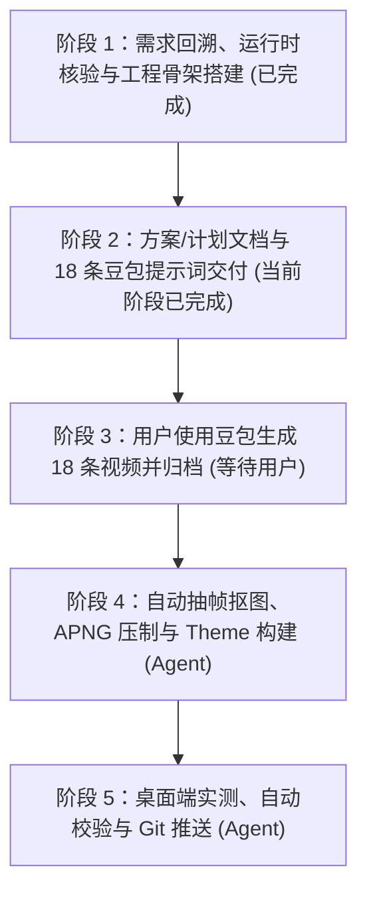

# 机械少女 R9.0 实施执行计划

> **原始需求与背景回溯**：
> - **提出时间**：2026-09-29
> - **业务背景**：`pet-forge` 为动画制作开源工坊，`clawd-on-desk`（`E:\Work2\AI_Work\tool\clawd-on-desk\clawd-on-desk\clawd-on-desk`）为桌面宠物运行时。用户需在 `work_space/R9_mechanical_girl1/` 下，以参考图片（3D 写实风米白色动力装甲 + 橙色条纹的冷面机械少女）为基准，沿用 `R7_dashuiniu` 已验证的 **APNG 路线** 制作高品质桌面宠物动画素材。
> - **用户原始诉求**：“项目下，我想按照APNG 路线方式，在R9_mechanical_girl1文件夹中按照R9_mechanical_girl1的图片上的角色生成动画素材，在R9_mechanical_girl1下，专门用于开源项目E:\Work2\AI_Work\tool\clawd-on-desk\clawd-on-desk\clawd-on-desk使用。你需要看下R1_doraemon，以及开源项目。并生成R9.0的方案和计划。你需要先给我生成每个动画的提示词，我去用豆包生成适配后，提供给你。动画动作需要符合图片角色的形象和特点。由于我是用豆包AI生成视频，所以提示词不用做哪种抽象，意境描述，因为AI可能难以理解，把动作动画描述清楚就行。”
> - **已拍板技术决策**：
>   1. **APNG 路线**：豆包图生视频 → `ffmpeg` 抽帧 → `rembg` 抠图去底（含豆包水印清除）→ PIL 压制 256×256 透明 APNG，完整复用 R7 流水线。
>   2. **提示词风格**：全部为具体物理动作描述（部位+动作+幅度+次数+节奏），拒绝抽象意境词；统一附带纯白背景、固定机位、全身居中、首尾无缝循环约束。
>   3. **运行时适配**：`eyeTracking.enabled: false`，走 `` 硬件加速通道与 `probeApngCycle` 循环探测。
>   4. **布局基线**：`viewBox 256×256`，`visibleHeightRatio: 0.42`，`baselineBottomRatio: 0.05`，`baselineY: 235`。
>   5. **方向与闭环**：`roam`/`carrying` 面朝右；循环状态首尾帧 100% 闭环。
>   6. **交付范围**：18 项 APNG（7 核心状态 + 11 进阶彩蛋，扩展包全面原创）+ `theme.json` + `process_all_videos.py` + `package-theme.ps1` + `install-to-clawd.ps1`。
> - **对接运行时**：Clawd-on-Desk (`theme.json` Schema v1)
> - **交付目标**：`work_space/R9_mechanical_girl1/`

---

## 1. 里程碑阶段规划

---

## 2. 阶段详细任务分解

### 阶段 1：需求回溯与工程骨架（已完成）
- [x] **任务 1.1**：核查 `clawd-on-desk` 源码（`theme-schema.js`、`animation-cycle.js`、`theme-loader.js`），确认 APNG 走 `` 通道、`probeApngCycle` 自动探测循环、`eyeTracking` 可禁用。
- [x] **任务 1.2**：核查 `R1_doraemon`（SVG 路线基准）与 `R7_dashuiniu`（APNG 路线先例：`01_raw_doubao` → `02_forge/process_all_videos.py` → `03_export` + `theme/assets` 全链路）。
- [x] **任务 1.3**：提取参考图角色特征（黑色齐刘海波波头、米白动力装甲+橙色条纹、青绿紧身服、天线与透明翻起面罩背包、机械手套、厚重装甲靴、裸露双腿、灰色连接管线）。
- [x] **任务 1.4**：创建 `R9_mechanical_girl1/` 标准工程骨架：`00_reference/`、`01_raw_doubao/`、`02_forge/`、`03_export/`、`theme/assets/`，参考图归档为 `00_reference/mechanical_girl1_reference.png`。

### 阶段 2：方案、计划与豆包提示词工程（已完成）
- [x] **任务 2.1**：编写 `docs/R9.0_机械少女_设计与技术方案.md`（角色设计哲学、APNG 架构对比、theme.json 规范、18 项状态矩阵、提示词工程库）。
- [x] **任务 2.2**：编写本执行计划文档。
- [x] **任务 2.3**：编制 18 条“通用锚定前缀 + 具体动作描述”式豆包提示词（idle / working / thinking / roam / sleeping / notification / error / react-drag / react-poke / react-double / jetpack-hover / holo-drone / energy-bar / visor-mirror / kata-blade / dust-vent / hover-crate / lag-reboot）。
- [x] **任务 2.4**：向用户汇报提示词库与协作流程，等待用户生成素材。

### 阶段 3：用户侧豆包素材生成（等待用户执行）
- [ ] **任务 3.1**：用户打开豆包 AI 视频生成，上传 `00_reference/mechanical_girl1_reference.png` 作为垫图。
- [ ] **任务 3.2**：逐条粘贴“通用锚定前缀 + 对应动作段”生成视频；确认纯白背景、固定机位、全身居中、`roam`/`carrying` 面朝右。
- [ ] **任务 3.3**：将 18 个 MP4 按状态文件名（如 `idle.mp4`、`working.mp4`、`react-drag.mp4`…）存入 `01_raw_doubao/`，通知 Agent 启动流水线。

### 阶段 4：APNG 压制与 Theme 构建（Agent 执行）
- [ ] **任务 4.1**：移植并适配 `02_forge/process_all_videos.py`（ffmpeg 10 FPS 抽帧 → rembg 抠图 → 豆包右下角水印清除 → alpha<25 噪声阈值 → 256×256 归一化）。
- [ ] **任务 4.2**：批量压制透明 APNG 至 `theme/assets/` 与 `03_export/`，并输出 GIF 预览至 `02_forge/` 与 `preview_all_states.html`。
- [ ] **任务 4.3**：生成无 BOM UTF-8 `theme/theme.json`（含 `workingTiers`、`idleAnimations`、`reactions`、`hitBoxes`）。
- [ ] **任务 4.4**：编写 `package-theme.ps1`（产出 `r9-mechanical-girl1.zip`，顶层仅 `theme.json` + `assets/`）与 `install-to-clawd.ps1`。

### 阶段 5：运行时实测与 Git 推送（Agent 执行）
- [ ] **任务 5.1**：执行 `install-to-clawd.ps1` 部署至 `%APPDATA%/clawd-on-desk/themes/mechanical-girl1`，运行时切换主题实测 18 项状态。
- [ ] **任务 5.2**：校验循环闭环、漫步镜像方向、桌面占比（0.42）、抠图无白边水印残留。
- [ ] **任务 5.3**：按 AGENTS.md Git 纪律提交并推送：`feat(R9): 完成机械少女 R9.0 全套 APNG 动画制作、主题打包与运行时部署`。

---

## 3. 质量门禁与成功判据

1. **APNG 视觉品质**：背景 100% 透明、无白边毛刺；“豆包AI生成”水印彻底清除；18 项状态循环无跳帧断层。
2. **角色一致性**：全部素材中发型、装甲配色（米白+橙条）、青绿紧身服、背包天线与透明面罩特征不漂移。
3. **Clawd 兼容性**：`theme.json` 无 BOM UTF-8 解析通过；`roam`/`carrying` 面朝右且左行自动镜像正确；`visibleHeightRatio: 0.42` 不遮挡工作区。
4. **工程完整性**：五级目录、方案/计划文档、压缩包与安装脚本齐备；远程仓库 `https://github.com/RyanChenJJH/pet-desk.git` main 分支同步成功。
