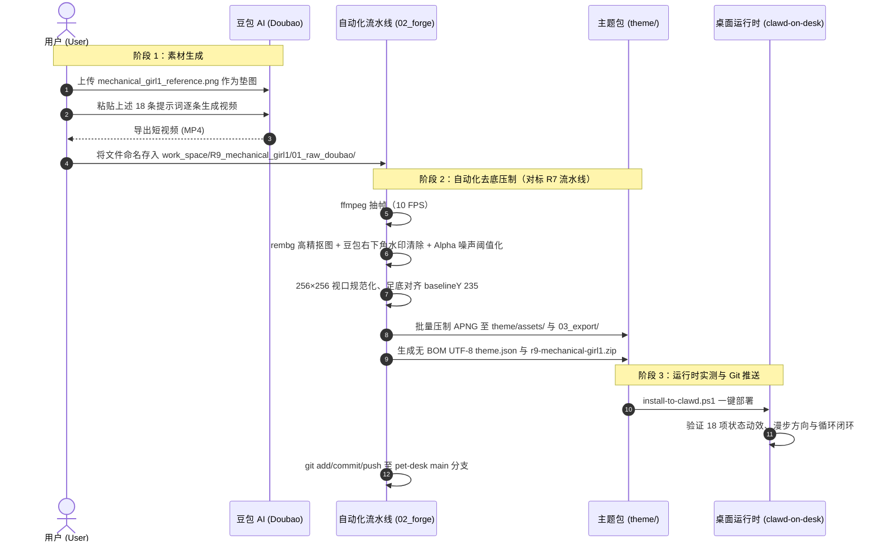

# 机械少女 R9.0 设计与技术方案

> **原始需求与背景回溯**：
> - **提出时间**：2026-09-29
> - **业务场景**：`pet-forge` 为动画制作开源工坊，`clawd-on-desk`（本地路径 `E:\Work2\AI_Work\tool\clawd-on-desk\clawd-on-desk\clawd-on-desk`）为桌面宠物运行时。项目下已有 `R1_doraemon`、`R2_clock`、`R3_dabaixiong`、`R4_GIRL`、`R5_labixiaoxin`、`R6_xiaotuzi`、`R7_dashuiniu`、`R8_wooden_fish`。当前需要在 `work_space/R9_mechanical_girl1/` 下，以用户提供的参考图片（豆包生成的 3D 写实风动力装甲机械少女）为基准，沿用 **APNG 路线**（对标 `R7_dashuiniu` 全套流水线）制作高品质桌面宠物动画素材。
> - **用户原始诉求**：“项目下，我想按照APNG 路线方式，在R9_mechanical_girl1文件夹中按照R9_mechanical_girl1的图片上的角色生成动画素材，在R9_mechanical_girl1下，专门用于开源项目E:\Work2\AI_Work\tool\clawd-on-desk\clawd-on-desk\clawd-on-desk使用。你需要看下R1_doraemon，以及开源项目。并生成R9.0的方案和计划。你需要先给我生成每个动画的提示词，我去用豆包生成适配后，提供给你。动画动作需要符合图片角色的形象和特点。由于我是用豆包AI生成视频，所以提示词不用做哪种抽象，意境描述，因为AI可能难以理解，把动作动画描述清楚就行。”
> - **已拍板技术决策**：
>   1. **APNG 位图动图技术路线**：对标 `R7_dashuiniu` 与 `calico` APNG 主题，走运行时原生 `` 硬件加速渲染通道；`animation-cycle.js` 的 `probeApngCycle` 自动探测帧时钟与循环时长；`theme.json` 配置 `eyeTracking.enabled: false`（眼神与微表情由 AI 视频直接烘焙）。
>   2. **提示词风格红线（用户明确拍板）**：面向豆包 AI 视频生成的提示词**拒绝抽象意境描述**，全部采用直白、具体、可执行的物理动作描述（谁、哪个部位、怎么动、动多快、动几次），并统一附带“纯白背景、固定机位、全身居中、首尾帧无缝循环”约束。
>   3. **尺寸基线与桌面黄金视口**：逻辑视口 `256×256`，`visibleHeightRatio: 0.42`，`baselineBottomRatio: 0.05`，严格遵守 AGENTS.md 固定尺寸基线。
>   4. **漫步方向与循环闭环**：`roam.apng`、`carrying.apng` 统一**面朝右侧**（运行时向左巡逻自动水平镜像）；循环状态首尾关键帧 100% 闭环。
>   5. **动作性格定位**：冷面自律的机甲驾驶员 + 反差萌（奶茶、打瞌睡、偷偷耍帅），所有动作必须围绕“厚重动力装甲 + 纤细少女体态”的反差与机甲机械细节（指示灯、天线、透明面罩、管线、电火花）展开。
>   6. **交付范围**：18 项状态/反应 APNG（7 核心状态 + 11 进阶彩蛋，全面原创不沿用 R7 动作模板）+ `theme.json` + 压制脚本 + 打包与安装脚本。
> - **对接运行时**：Clawd-on-Desk (`theme.json` Schema v1)
> - **交付目标**：`work_space/R9_mechanical_girl1/`

---

## 1. 方案概述与角色设计哲学

参考图为豆包 AI 生成的 3D 写实渲染风“动力装甲少女”：纤细的少女身躯被包裹在体积感极强的重型外骨骼机甲中，天然具备“钢铁洪流 vs 娇小少女”的顶级视觉反差。

### 1.1 核心特征提炼与锚定（提示词形象基准）
1. **头部与面部**：
   - **黑色齐刘海短发（波波头）**：发尾齐腮，是角色最醒目的识别特征，所有动作中发梢的轻微摆动是“活起来”的关键。
   - **冷峻平静的面容**：眼神淡漠、嘴角几乎无表情，是“冷面驾驶员”人设核心；微笑必须克制（仅嘴角轻抬），符合人物性格。
   - **透明翻起式面罩**：一块透明护目面罩向上翻起悬于头部后侧，是专属道具，可在 `react-double`（耍帅拉下面罩）等动作中复用。
2. **机甲与服饰**：
   - **米白色重型动力装甲**：肩甲、胸甲、臂甲、腿甲体积厚重，带**橙色条纹涂装**与做旧磨损划痕。
   - **青绿色紧身服**：装甲之下为青绿色连体紧身衣，短裤设计露出纤细双腿（与厚重机甲形成反差）。
   - **大型机械背包**：头顶左后侧带**黑色天线**，背包通过**灰色软管/线缆**连接手臂与腿部，是电火花、指示灯、推进白烟等特效的挂载点。
   - **深色机械手套与厚重装甲靴**：米白机械靴体积庞大，深色手套手指为机械结构。
3. **动作性格特征**：
   - **军人式自律 + 机械精准**：站立笔挺、行走正步、反应利落。
   - **反差萌**：冷面喝奶茶、站岗打瞌睡、偷偷检查仪容、被拎起来时慌乱扑腾。
   - **机甲语言**：橙色呼吸指示灯、全息投影界面、电火花、伺服电机式转头，用机械细节代替夸张表情。

---

## 2. APNG 路线与 SVG 路线的架构对比（对标 R7）

| 维度 | R1_doraemon (纯 SVG 路线) | R9_mechanical_girl1 (APNG 路线) |
|---|---|---|
| **资产载体** | 矢量 XML 代码 (`.svg`) | 带 Alpha 透明通道的高清位图动画帧 (`.apng`) |
| **视觉呈现** | 扁平几何色块、CSS 关键帧 | 3D 写实质感：金属装甲反光、布料褶皱、发丝、全息光效 |
| **Clawd 渲染通道** | `<object>` 容器 + SVG DOM 操纵 | `` 硬件加速纯净位图渲染通道 |
| **眼球光标跟随** | `#eyes-js` / `#body-js` / `#shadow-js` 挂点 | `eyeTracking.enabled: false`（微表情由 AI 烘焙） |
| **循环检测** | 解析 SVG 内联 CSS/SMIL 时长 | `probeApngCycle` 自动探测帧时钟 |
| **生产流水线** | 手工分层矢量描摹 | 豆包图生视频 → `ffmpeg` 抽帧 → `rembg` 抠图 → PIL 压制 APNG |

---

## 3. 运行环境与 Theme 配置规范 (`theme.json`)

`work_space/R9_mechanical_girl1/theme/theme.json` 严格遵守 Clawd Schema v1，保存为 **无 BOM 的纯 UTF-8 编码**：

```json
{
  "schemaVersion": 1,
  "name": "Mechanical Girl",
  "author": "Qoder & User",
  "version": "1.0.0",
  "description": "Cool exoskeleton mecha girl desktop pet with animated APNG assets.",
  "viewBox": { "x": 0, "y": 0, "width": 256, "height": 256 },
  "layout": {
    "contentBox": { "x": 32, "y": 20, "width": 192, "height": 215 },
    "centerX": 128,
    "baselineY": 235,
    "visibleHeightRatio": 0.42,
    "baselineBottomRatio": 0.05
  },
  "eyeTracking": { "enabled": false },
  "states": {
    "idle": ["idle.apng"],
    "roam": ["roam.apng"],
    "working": ["working.apng"],
    "thinking": ["thinking.apng"],
    "sleeping": ["sleeping.apng"],
    "notification": ["notification.apng"],
    "attention": ["notification.apng"],
    "error": ["error.apng"],
    "sweeping": ["polish-armor.apng"],
    "carrying": ["cable-stuck.apng"],
    "dozing": ["lag-reboot.apng"]
  },
  "workingTiers": [
    { "minSessions": 2, "file": "checklist.apng" },
    { "minSessions": 1, "file": "working.apng" }
  ],
  "idleAnimations": [
    { "file": "jetpack-hover.apng", "duration": 4000 },
    { "file": "holo-drone.apng", "duration": 4000 },
    { "file": "servo-check.apng", "duration": 4000 },
    { "file": "boot-stomp.apng", "duration": 4000 }
  ],
  "reactions": {
    "drag": { "file": "react-drag.apng" },
    "clickLeft": { "file": "react-poke.apng", "duration": 2500 },
    "clickRight": { "file": "react-poke.apng", "duration": 2500 },
    "double": { "files": ["react-double.apng"], "duration": 3000 }
  },
  "sleepSequence": { "mode": "direct" },
  "hitBoxes": {
    "default": { "x": 32, "y": 20, "w": 192, "h": 215 },
    "sleeping": { "x": 30, "y": 96, "w": 196, "h": 139 }
  },
  "sleepingHitboxFiles": ["sleeping.apng"]
}
```

---

## 4. 状态动画矩阵与视觉语义设计（18 项）

| # | 状态名 | 资产文件 | 动作视觉语义（贴合机械少女形象） | 循环与方向 |
|---|---|---|---|---|
| 1 | `idle` | `idle.apng` | 笔挺站姿待机：胸口随呼吸微起伏，背包橙色指示灯缓慢呼吸闪烁，每 2~3 秒眨眼一次，手指偶尔张合，发梢轻摆 | 无缝循环 |
| 2 | `working` | `working.apng` | **全息操作台**：面前悬浮 3 块橙色半透明全息屏幕，双手快速点击虚拟键盘，屏幕光映在脸上，头部随内容微动 | 无缝循环 |
| 3 | `thinking` | `thinking.apng` | 食指轻点下唇，头微歪视线上瞟；头顶天线亮圈，身旁浮出旋转的橙色全息小问号后消散 | 无缝循环 |
| 4 | `roam` | `roam.apng` | **面朝右侧**正步巡逻：高抬腿军人步原地行走，手臂规律前后摆，上身笔挺，背包管线随步伐微晃 | 面朝右，无缝循环 |
| 5 | `sleeping` | `sleeping.apng` | 抱膝坐地低电量休眠：头枕膝侧闭眼，呼吸极缓，指示灯转蓝绿慢闪，每 2 秒浮出小“Z”消散 | 无缝循环 |
| 6 | `notification` | `notification.apng` | 抬头对镜头竖大拇指，嘴角轻抬浅笑；头顶炸开 2~3 点橙色小礼花光斑，肩甲指示灯快闪两下 | 短循环 |
| 7 | `error` | `error.apng` | 双手按头皱眉闭眼；背包迸出蓝白小电火花，面罩位置闪烁红色“×”全息警告，跺肩轻抖 | 无缝循环 |
| 8 | `react-drag` | `react-drag.apng` | 被拎起瞬间全身僵直成木板：双臂贴紧双腿并拢，只有机械靴在空中咔哒相碰，背包红色警报灯快闪，瞪眼委屈 | 无缝循环 |
| 9 | `react-poke` | `react-poke.apng` | 头缓缓转向镜头冷眼盯视，身旁弹出红色全息“！”后消失，面罩被食指推下半格再弹回，肩甲扫描环过眼一次 | 循环 |
| 10 | `react-double` | `react-double.apng` | 双指敲太阳穴，“咔哒”拉下面罩，橙色扫描光横过面罩一次，右手干脆军礼，面罩弹回原位归正 | 短循环 |
| 11 | `jetpack-hover` | `jetpack-hover.apng` | **推进器悬浮**：背包双喷口点火喷出蓝白火焰，离地悬停 20 厘米，膝微屈脚悬空上下浮沉，发梢被气流向上吹起 | 无缝循环 |
| 12 | `holo-drone` | `holo-drone.apng` | **全息小无人机**：巴掌大橙色全息无人机绕头盘旋，她抬手驱赶落空皱眉，最后无人机停上头顶，她僵住翻白眼 | 无缝循环 |
| 13 | `servo-check` | `servo-check.apng` | **关节自检**：右臂缓慢屈伸两次侧耳听肘部伺服声，指节敲两下关节，甲缝亮起一道橙光，点头收臂 | 无缝循环 |
| 14 | `boot-stomp` | `boot-stomp.apng` | **跺靴除尘**：抬右脚跺地两下听闷响，低头用指节敲敲靴头，再抬脚在另一靴侧蹭掉灰尘，恢复立正 | 无缝循环 |
| 15 | `checklist` | `checklist.apng` | **全息清单核销（多会话进阶工作）**：橙色半透明清单板悬浮身前，食指逐条下滑打勾，偶尔停顿抬眼思考 | 无缝循环 |
| 16 | `polish-armor` | `polish-armor.apng` | **擦拭肩甲**：拿小布来回慢擦左肩甲除尘，举起布见已变脏，甩手丢到身后继续擦右肩甲 | 循环 |
| 17 | `cable-stuck` | `cable-stuck.apng` | **管线挂住（面朝右侧）**：原地行走时背包软管挂地人被拽前倾，停步双手理顺抖开，搭过肩继续走 | 面朝右，循环 |
| 18 | `lag-reboot` | `lag-reboot.apng` | **低电量卡顿重启**：指示灯变红快闪，动作卡顿掉帧（抬手停半空、转头分两格），拔出电池重插，瞬间恢复流畅挺胸 | 无缝循环 |

---

## 5. 豆包 AI 生成提示词工程库

### 5.1 生成规范红线
1. **必须垫图**：上传 `work_space/R9_mechanical_girl1/00_reference/mechanical_girl1_reference.png` 作为图生视频基准，保证 100% 角色一致性。
2. **纯白背景**：每段提示词自带“纯白色背景，无阴影”，方便 `rembg` 一键抠图。
3. **固定机位**：自带“镜头固定，不移动不缩放”，角色原地动作不位移。
4. **循环闭环**：循环状态自带“动作首尾帧一致，无缝循环”。
5. **描述风格（用户拍板）**：只写具体物理动作（部位+动作+幅度+次数+节奏），不写抽象意境词。

### 5.2 通用角色锚定前缀（每条提示词开头必带）

> 参考图中的黑色齐刘海短发少女，身穿米白色重型动力装甲，装甲带橙色条纹和磨损划痕，内穿青绿色紧身短裤服，双腿裸露，背后有大型机械背包、一根黑色天线和一块向上翻起的透明面罩，灰色软管连接装甲，双手深色机械手套，脚穿米白色厚重机械靴。3D写实渲染风格。全身完整显示在画面正中央，镜头固定不动不缩放，纯白色背景，无阴影。

### 5.3 各状态提示词（动作段直接接在前缀后）

#### 1. `idle` 待机
> 少女保持原地笔挺站立，不移动位置。胸口随呼吸缓慢起伏，背后背包上的橙色小指示灯忽明忽暗缓慢闪烁。她每隔两三秒眨一次眼睛，双手手指偶尔缓慢张开再握拳一次，黑色短发发梢轻微摆动。全程表情平静。动作首尾帧一致，无缝循环。

#### 2. `working` 全息操作（核心状态）
> 少女面前悬浮三块橙色半透明的全息发光屏幕。她双手抬起，戴机械手套的手指在虚拟键盘上快速交替点击敲击，手指动作快。屏幕的光映在她脸上，她头部随屏幕内容轻微上下点左右移动，表情专注认真。全息屏幕持续闪动滚动数据。动作首尾帧一致，无缝循环。

#### 3. `thinking` 思考
> 少女右手食指抵在下唇上轻轻点动，头微微歪向左侧，眼睛闭上再睁开并往斜上方看。背后天线的顶端亮起一圈小光点。她头侧浮出一个橙色半透明的全息小问号，问号缓慢旋转两圈后消失，然后新的问号再出现。动作首尾帧一致，无缝循环。

#### 4. `roam` 巡逻漫步（面朝右）
> 少女整体完全面朝右侧站立。她做原地高抬腿正步行走动作：膝盖依次抬高，厚重机械靴踏地，双臂随步伐前后规律摆动，上身保持笔直，背后背包和灰色软管随每一步轻微晃动，短发发梢随步伐摆动。步伐速度均匀不变。动作首尾帧一致，无缝循环。

#### 5. `sleeping` 休眠
> 少女坐在地上，双膝弯曲，双臂环抱膝盖，头侧枕在膝盖上，双眼闭合。胸口呼吸起伏非常缓慢。背包指示灯变成蓝绿色并缓慢闪烁。她头顶每隔两秒浮出一个半透明的小写字母“Z”，向上飘并消失，循环出现。动作首尾帧一致，无缝循环。

#### 6. `notification` 通知/点赞
> 少女原本低着头，突然抬头看向镜头，右手抬起对镜头竖起大拇指，嘴角轻微上抬露出浅笑。她头顶炸开两三个橙色的细小礼花光点并向四周散落消失。肩甲上的小指示灯快速闪烁两下。动作完成后保持姿势轻微呼吸。短动作循环。

#### 7. `error` 故障
> 少女双手抬起按住头部两侧，皱眉闭眼。背后背包接口处迸出两三下蓝白色小电火花并冒一小缕青烟。她头前那块透明面罩位置闪烁红色半透明的“×”形全息警告符号。她肩膀耸动一下，跺一下脚，全身轻微发抖。动作首尾帧一致，无缝循环。

#### 8. `react-drag` 被拎起（全身僵直木板）
> 少女的身体被一股无形的力水平拎起悬在空中，双脚离地。她的全身瞬间绷直僵住，像一块木板：双臂紧贴身体两侧，双腿并拢伸直，只有两只厚重机械靴在空中轻轻相碰咔哒作响。她眼睛睁大表情委屈地盯着镜头，背后背包上的红色小警报灯快速闪烁，短发向下垂。僵直悬空动作首尾帧一致，无缝循环。

#### 9. `react-poke` 被戳（全息感叹号冷眼盯视）
> 少女身体不动，头部缓缓转向镜头，表情冷淡地盯住前方。她头侧弹出一个红色半透明的全息感叹号“！”停留一下后消失。她脸前那块透明面罩向下一滑盖住半张脸，又被她右手食指顶回原位。肩甲上一圈橙色环形灯快速扫过一遍。动作首尾帧一致，无缝循环。

#### 10. `react-double` 双击（面罩启动军礼）
> 少女右手抬起用食指和中指敲了两下太阳穴位置，透明面罩“咔哒”一声从头顶翻下盖住整张脸，面罩表面一道橙色扫描光从左到右流过一次。随后她右手抬起干脆地敬了一个军礼，面罩自动翻回头顶原位，她放下手恢复立正。短动作循环。

#### 11. `jetpack-hover` 推进器悬浮
> 少女背后背包下方的两个推进器口点火，喷出两股蓝白色短火焰。她的身体缓慢离开地面，悬停在离地20厘米的空中，双膝微微弯曲，双脚自然悬空。她在空中缓慢上下浮沉，双臂向两侧微微张开保持平衡，短发发梢被气流向上吹起，表情略微紧张盯着下方。全程双脚不落地。动作首尾帧一致，无缝循环。

#### 12. `holo-drone` 全息小无人机绕头
> 一个巴掌大小、橙色半透明、带四个小旋翼的全息无人机绕着少女的头部盘旋飞行。她先抬起右手挥了一下驱赶，无人机躲开继续绕圈，她皱眉又挥了两下都没打到。最后无人机停落在她头顶，她手臂垂下身体僵住，眼睛往上翻看了一眼头顶。盘旋光点持续闪烁。动作首尾帧一致，无缝循环。

#### 13. `servo-check` 关节自检
> 少女右臂向前下方缓慢弯曲再伸直，重复两次，同时头微微低向右侧，侧耳倾听肘部关节装甲的声音。她抬起左手用指节在右肘装甲上敲了两下，被敲的关节接缝处亮起一道细细的橙色光条又熄灭。她满意地点一下头，双臂放回身体两侧恢复立正。动作首尾帧一致，无缝循环。

#### 14. `boot-stomp` 跺靴除尘
> 少女抬起右脚在原地跺地两下，厚重机械靴发出沉闷的落地感，地面轻微震动。她低头看靴子，弯腰用右手指节敲了两下靴头。然后她抬起右脚在左脚靴子外侧蹭了两下，抖掉靴底的灰，收回脚恢复立正站姿，视线回到正前方。动作首尾帧一致，无缝循环。

#### 15. `checklist` 全息清单核销（多会话进阶工作）
> 一块橙色半透明的全息清单板悬浮在少女胸前，板上有数行发光的条目文字。她右手食指按住清单向上滑动一行，在条目旁点出一个对勾标记，再滑动一行再打勾，动作规律清晰。中途她停顿一秒抬眼想了一下，随后低头继续滑动打勾。清单持续有条目被核销。动作首尾帧一致，无缝循环。

#### 16. `polish-armor` 擦拭肩甲
> 少女右手拿一块小布，贴在左肩甲上来回缓慢擦拭四五下，擦去表面灰尘，身体随擦拭动作轻微晃动。她举起小布低头看了一眼，布已经变脏，她把布随手丢到身后，换右手继续擦拭右侧肩甲。动作首尾帧一致，无缝循环。

#### 17. `cable-stuck` 管线挂住（面朝右）
> 少女整体完全面朝右侧原地迈步。背后背包垂下的一根灰色软管末端挂在了地面上，她被向后拽得身体前倾、脚步停住。她停步转身弯腰，双手把软管解开来，上下抖了两下理顺，再把软管搭过肩膀垂在身前，转回面朝右侧继续沉稳原地迈步。动作首尾帧一致，无缝循环。

#### 18. `lag-reboot` 低电量卡顿重启
> 少女背包指示灯变成红色并快速闪烁。她的动作变得卡顿僵硬：抬手抬到一半突然停住，转头分成两格机械地转动，身体摇晃两下像要倒下又定住。她抬起左手从背包侧面拔出发光的电池，停顿一下再插回去，指示灯恢复橙色，她身体瞬间挺直，动作恢复流畅，轻轻点头。动作首尾帧一致，无缝循环。

---

## 6. 资产制作与交付流程（用户与 Agent 协作）


